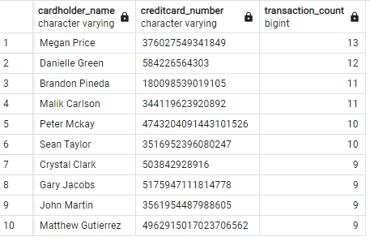
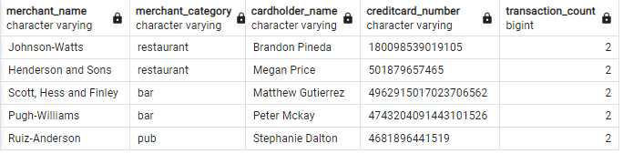
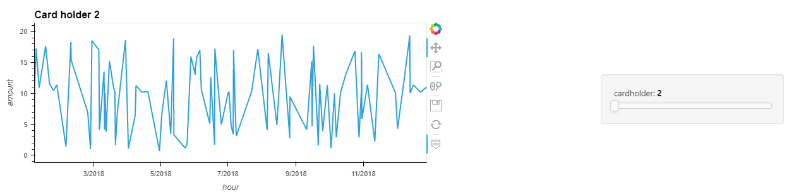
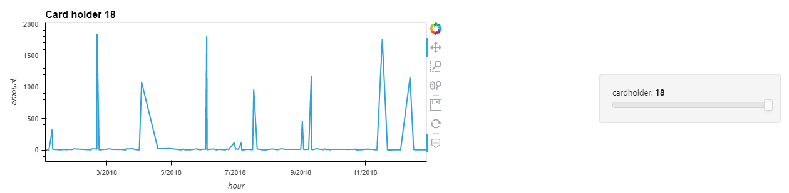
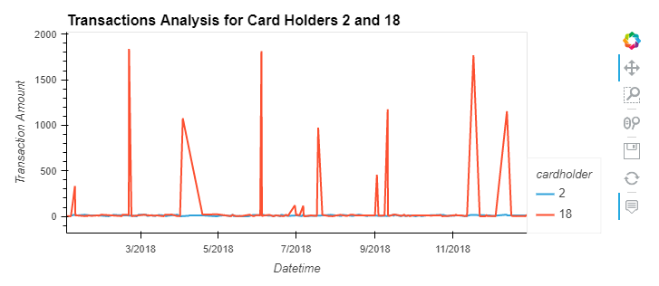
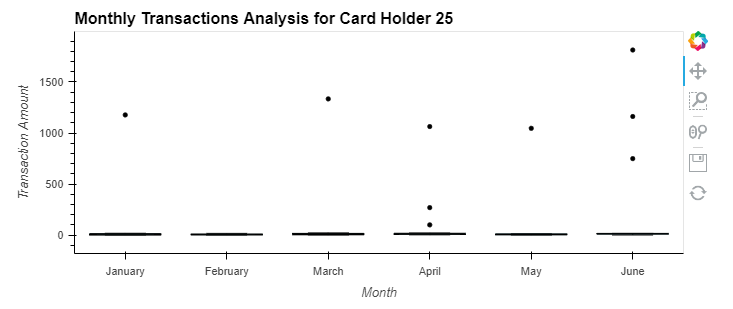

# creditcard_fraud_analysis
Fraud Analysis of Credit Card transactions

Assignment for Looking for Suspicious Transactions

Data Modelling, Data Engineering, Data Analysis for suspicious fraud transactions

#
#

# <b>Data Analysis Report</b>

#

# Part 1

<b>Question:</b> How can you isolate (or group) the transactions of each cardholder?

<b>Answer:</b> Query of the view "cardholder_transaction" will provide the list of transactions grouped for each of the cardholder.

#

<b>Question:</b> Count the transactions that are less than $2.00 per cardholder.

<b>Answer:</b> Query of the view "transaction_lessthan$2" will provide the count of transactions that are less than $2.00 per cardholder.

#

<b>Question:</b> Is there any evidence to suggest that a credit card has been hacked? Explain your rationale.

<b>Answer:</b> Yes there are quite a good evidence to say that a credit card for a card holder has been hacked. The card holders who have too many transactions of less than $2.00 on their credit card, are potentially been hacked. For e.g. following top 10 credit cards for various card holders might be potentially hacked.

#

<b>Question:</b> What are the top 100 highest transactions made between 7:00 am and 9:00 am?

<b>Answer:</b> Query of the view "transaction_bw7and9" with limit of top 100 will provide the list of top 100 highest transactions made between 7:00 am and 9:00 am.

#
<b>Question:</b> Do you see any anomalous transactions that could be fraudulent?

<b>Answer:</b> Yes there are anomalous transactions in some credit cards. If there are many small transacations in a credit card then they are could be fraudulent.

#

<b>Question:</b>Is there a higher number of fraudulent transactions made during this time frame versus the rest of the day?

<b>Answer:</b> Here assuming that transaction less than $2.00 could be fraudulent. Total number of such possible fraudulent transactions between 7 am to 9 am are 30 across various merchant categories. Total number of such possible fraudulent transactions for the rest of day are 320 across various merchant categories. This is almost 8.6% of such possible farudulent transacations happened during this time frame between 7 am and 9 am for various merchant categories.
But this doesn't give any pattern of to say that there is a higher number of fraudulent transactions happened during this timeframe of the day for any particular type of merchant category.

#

<b>Question:</b> If you answered yes to the previous question, explain why you think there might be fraudulent transactions during this time frame.

<b>Answer:</b> Fraudulent transactions happen through out the day and not only during the said time frame of 7 am to 9 am for various merchant categories. 

#

<b>Question:</b> What are the top 5 merchants prone to being hacked using small transactions?

<b>Answer:</b> Assuming that small transactions are the ones which are less than  $2.00 , following merchants are the top 5 returants, bar and pub prone to being hacked using small transacations:- 
Johnson-Watts (resturant), Henderson and Sons (resturant),  Hess and Finley Scott (bar), Pugh-Williams (bar), Ruiz-Anderson (pub).

#

# Part 2

Line plot representing the time series of transactions over the course of the year for each cardholder 2 and 18

#

Single line plot containing both card holders' trend data

#

<b>Question: </b> What difference do you observe between the consumption patterns? Does the difference suggest a fraudulent transaction? Explain your rationale.

<b>Answer:</b> For Card holder 18 there are many sudden high amount of transaction and then very small amount of transacation, compared to Card holder 2. Card holder 2 have regular amount of transactions. This explaines Card holder 18 might have fraudulent transacations.

#
#

Box plot, representing the expenditure data from January 2018 to June 2018 for cardholder ID 25.

<b> Question: </b> Are there any outliers for cardholder ID 25? How many outliers are there per month?

<b>Answer:</b> Yes there are outliers of transacations every month except in February. In January, March, May there is 1 outlier each. In April and June there are 3 outliers each. There are no outliers in February.

#
<b>Question:</b> Do you notice any anomalies? Describe your observations and conclusions.

<b>Answer:</b> Yes sudden spikes of transactions in the month of January, March, April, May and June are anomalies. These sudden high amount of transactions  looks to be fraudulent transactions.

